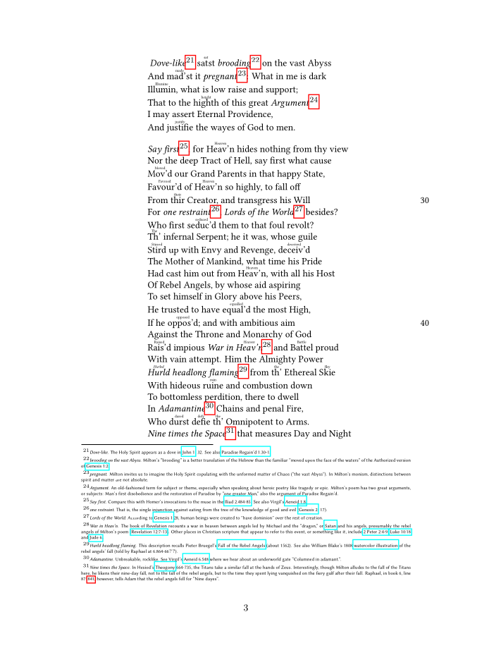

# Paradise Lost Crawler

Crawls the content of the more than excellent Dartmouth "The John Milton Reading Room", including the text annotations.
It also converts them into a ready to use tex-formatted version, which allows to easily create a pdf for !PERSONAL USE!.

## Features
* Annotations as footnotes
* Modern Spellings can be places as overtext or used as in-place replacement
* Internal links for works and lines
* External references as default links

## License
The code itself is under MIT, see repository.

The content it crawls is NOT UNDER MIT:
[Read the original license information of the reading room.](https://www.dartmouth.edu/~milton/reading_room/copyrights/text.shtml)
